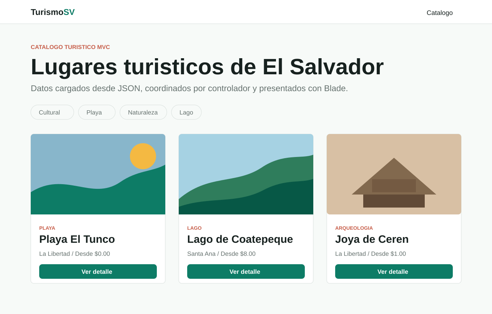
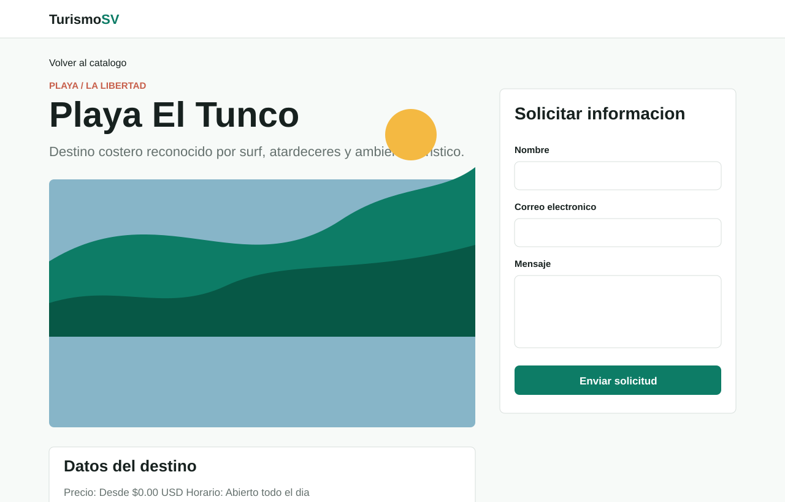

# Catalogo turistico MVC en Laravel

Aplicacion web desarrollada en Laravel para demostrar el patron MVC mediante un catalogo de lugares turisticos de El Salvador. Los datos principales se leen desde un archivo JSON propio y se presentan en vistas Blade.

## Requisitos

- PHP 8.3 o superior.
- Composer.
- Node.js y npm, solo si deseas compilar assets de Vite.

## Instalacion

1. Clonar el repositorio:

```bash
git clone https://github.com/Michh8/mvcProject.git
cd mvcProject
```

2. Instalar dependencias de PHP:

```bash
composer install
```

3. Crear el archivo de entorno y generar la llave:

```bash
cp .env.example .env
php artisan key:generate
```

4. Iniciar el servidor local:

```bash
php artisan serve
```

5. Abrir la aplicacion en:

```text
http://127.0.0.1:8000
```

## Flujo MVC implementado

1. El usuario visita `/` o `/lugares/{slug}` desde el navegador.
2. Laravel recibe la peticion HTTP y busca una coincidencia en `routes/web.php`.
3. La ruta llama a `LugarTuristicoController`.
4. El controlador solicita datos al modelo `App\Models\LugarTuristico`.
5. El modelo lee `database/data/lugares_turisticos.json`, transforma los datos en colecciones y devuelve la informacion requerida.
6. El controlador envia esos datos a las vistas Blade en `resources/views/lugares`.
7. La vista renderiza HTML con tarjetas, detalle del destino y formulario de contacto.
8. Al enviar el formulario, el controlador valida la peticion y el modelo guarda la solicitud en `storage/app/private/solicitudes_contacto.json`.

## Rutas principales

| Metodo | Ruta | Accion |
| --- | --- | --- |
| GET | `/` | Lista todos los destinos turisticos |
| GET | `/lugares/{slug}` | Muestra el detalle de un destino |
| POST | `/lugares/{slug}/contacto` | Recibe el formulario de solicitud de informacion |

## Datos JSON

El archivo de datos usado por la aplicacion esta en:

```text
database/data/lugares_turisticos.json
```

Incluye titulo, departamento, categoria, precio, horario, descripcion, servicios, mejor epoca e imagen de referencia para cada destino.

## Capturas de pantalla

Las capturas incluidas documentan las pantallas esperadas del sistema:





## Pruebas

Cuando el entorno tenga PHP y Composer instalados, puedes ejecutar:

```bash
php artisan test
```

Las pruebas Feature validan que el catalogo cargue, que un destino especifico pueda consultarse y que el formulario de contacto redirija correctamente.

## Archivos relevantes

- `routes/web.php`: define el ciclo de entrada de las peticiones.
- `app/Http/Controllers/LugarTuristicoController.php`: coordina el flujo entre rutas, modelo y vistas.
- `app/Models/LugarTuristico.php`: lee el JSON y registra solicitudes de contacto.
- `resources/views/layouts/app.blade.php`: layout base de la interfaz.
- `resources/views/lugares/index.blade.php`: vista de listado.
- `resources/views/lugares/show.blade.php`: vista de detalle y contacto.
- `database/data/lugares_turisticos.json`: datos de prueba.

## Fuentes de imagenes

Las imagenes se referencian desde Wikimedia Commons mediante enlaces `Special:FilePath` y cada registro JSON incluye `credito_imagen`.
